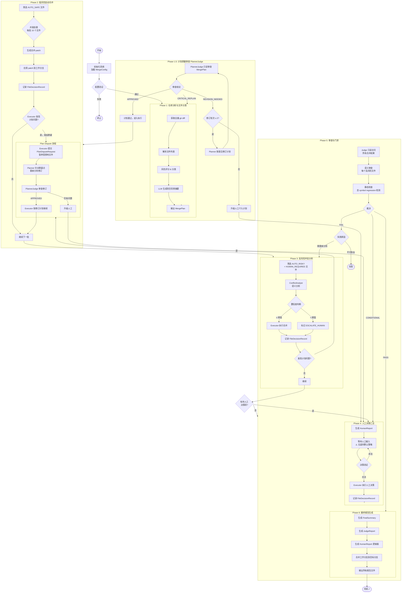
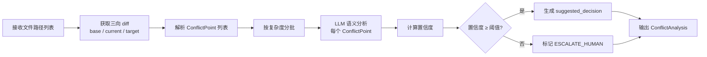

# 执行流程设计文档

## 目录

1. [系统状态机定义](#1-系统状态机定义)
2. [完整执行流程图](#2-完整执行流程图)
3. [各 Phase 详细流程](#3-各-phase-详细流程)
4. [并发执行策略](#4-并发执行策略)
5. [错误处理与回滚策略](#5-错误处理与回滚策略)
6. [断点续传机制](#6-断点续传机制)

---

## 1. 系统状态机定义

### 1.1 状态枚举

```
INITIALIZED          →  系统已初始化，配置已加载，尚未开始分析
PLANNING             →  Planner Agent 正在分析 diff，生成合并计划
PLAN_REVIEWING       →  PlannerJudge 正在审查计划质量（Phase 1.5）
PLAN_REVISING        →  Planner 正在按 PlannerJudge 意见修订计划
AUTO_MERGING         →  Executor 正在处理低风险文件（Phase 2）
PLAN_DISPUTE_PENDING →  Executor 发起计划质疑，等待 Planner 修订
ANALYZING_CONFLICTS  →  ConflictAnalyst + Executor 处理高风险文件（Phase 3）
AWAITING_HUMAN       →  系统暂停，等待人工输入决策（Phase 4）
JUDGE_REVIEWING      →  Judge Agent 正在审查合并结果（Phase 5）
GENERATING_REPORT    →  生成最终报告（Phase 6）
COMPLETED            →  全流程成功完成
FAILED               →  不可恢复的错误，需要人工介入
PAUSED               →  用户手动暂停（支持断点续传）
```

### 1.2 状态转换规则

```
INITIALIZED
  ├─[config validated]──────────────────────→ PLANNING
  └─[config invalid]────────────────────────→ FAILED

PLANNING
  ├─[plan created successfully]─────────────→ PLAN_REVIEWING
  └─[git error / LLM error]─────────────────→ FAILED

PLAN_REVIEWING                                # 新增：PlannerJudge 审查
  ├─[APPROVED]──────────────────────────────→ AUTO_MERGING
  ├─[REVISION_NEEDED, rounds < max]─────────→ PLAN_REVISING
  ├─[REVISION_NEEDED, rounds == max]────────→ AWAITING_HUMAN (人工介入计划)
  ├─[CRITICAL_REPLAN]───────────────────────→ PLANNING (完整重规划)
  └─[error]─────────────────────────────────→ FAILED

PLAN_REVISING                                 # 新增：Planner 修订计划
  ├─[revision complete]─────────────────────→ PLAN_REVIEWING (再次审查)
  └─[error]─────────────────────────────────→ FAILED

AUTO_MERGING
  ├─[all auto-safe files processed]─────────→ ANALYZING_CONFLICTS
  ├─[no risky/human files]──────────────────→ JUDGE_REVIEWING (跳过 Phase 3/4)
  ├─[plan dispute raised]───────────────────→ PLAN_DISPUTE_PENDING
  ├─[critical error]────────────────────────→ FAILED
  └─[user pause]────────────────────────────→ PAUSED

PLAN_DISPUTE_PENDING                          # 新增：Executor 质疑触发 Planner 修订
  ├─[planner revised plan]──────────────────→ PLAN_REVIEWING (PlannerJudge 审查修订)
  └─[planner cannot resolve dispute]────────→ AWAITING_HUMAN

ANALYZING_CONFLICTS
  ├─[analysis complete, has ESCALATE_HUMAN]─→ AWAITING_HUMAN
  ├─[analysis complete, no human needed]────→ JUDGE_REVIEWING
  ├─[plan dispute raised]───────────────────→ PLAN_DISPUTE_PENDING
  └─[error]─────────────────────────────────→ FAILED

AWAITING_HUMAN
  ├─[all human decisions received]──────────→ ANALYZING_CONFLICTS (执行人工决策)
  │                                            或 JUDGE_REVIEWING (若无更多待处理)
  │  ⚠️  注意：不存在"超时默认策略"转换。人工决策必须显式完成。
  └─[user abort]────────────────────────────→ FAILED

JUDGE_REVIEWING
  ├─[PASS]──────────────────────────────────→ GENERATING_REPORT
  ├─[CONDITIONAL]───────────────────────────→ AWAITING_HUMAN (修复条件问题)
  ├─[FAIL, cause=analysis_needed]───────────→ ANALYZING_CONFLICTS (重新分析)
  └─[FAIL, cause=fatal]─────────────────────→ FAILED

GENERATING_REPORT
  ├─[reports written]───────────────────────→ COMPLETED
  └─[write error]───────────────────────────→ FAILED (non-blocking，仅记录)

PAUSED
  └─[resume command]────────────────────────→ (恢复到暂停前的状态)

COMPLETED / FAILED
  └─ 终态，不再转换
```

---

## 2. 完整执行流程图

### 2.1 主流程总览



### 2.2 ConflictAnalyst 内部流程



---

## 3. 各 Phase 详细流程

### 3.1 Phase 1：仓库分析与文件分类

**目标**：完整理解两分支差异，生成可执行的合并计划。

**执行步骤**：

```
1. 验证 Git 仓库状态
   - 检查 upstream_ref 和 fork_ref 是否存在
   - 确认工作区干净（无未提交变更）
   - 获取 merge-base commit hash

2. 全量 diff 分析
   - 执行: git diff <merge-base>..<fork_ref> --name-status
   - 获取所有变更文件列表（新增/修改/删除/重命名）

3. 文件风险评分（并发处理）
   - 对每个文件计算风险分数：
     * 文件大小分（大文件更高风险）
     * 冲突密度分（冲突行数/总行数）
     * 历史变更频率分（频繁修改的文件风险更高）
     * 文件类型分（核心逻辑 > 配置 > 测试 > 文档）
     * 安全敏感度分（匹配安全敏感路径模式）
   - 综合加权得出 0.0~1.0 的风险分数

4. 文件分类
   - risk_score < 0.3  → AUTO_SAFE
   - 0.3 ≤ risk_score < 0.6  → AUTO_RISKY
   - risk_score ≥ 0.6  → HUMAN_REQUIRED
   - 仅删除操作  → DELETED_ONLY
   - 二进制文件  → BINARY
   - 匹配排除规则  → EXCLUDED

5. LLM 辅助（可选，按配置启用）
   - 提取代码架构摘要（README、主要模块入口）
   - 生成 project_context_summary 辅助后续分析

6. 输出 MergePlan
   - 将分类结果组织为 Phase 批次
   - 生成 RiskSummary 统计
   - 保存检查点
```

**预期耗时**：500 文件约 2-5 分钟（含 git 操作和并发风险评分）

---

### 3.15 Phase 1.5：计划质量审查（PlannerJudge）

**目标**：在执行阶段开始前，由独立 Agent 验证 MergePlan 的质量，防止低质量计划流入执行阶段。

**执行步骤**：

```
1. PlannerJudge 接收 MergePlan（只读）

2. 计划质量检查清单
   a. 风险低估检查
      - 扫描 AUTO_SAFE 文件，用独立 LLM 抽样验证：
        * 认证/权限/安全路径是否被错分为低风险？
        * 数据模型/schema 变更是否被忽略？
      - 若发现风险低估文件数 > 阈值，输出 REVISION_NEEDED

   b. 粒度合理性检查
      - 检查 Phase 批次中是否存在强耦合文件被拆分
      - 识别接口文件与实现文件是否在同一 Phase
      - 识别测试文件与被测文件是否配对处理

   c. 高风险完整性检查
      - 比对 config.critical_paths，确认所有关键路径文件均被正确标记
      - 验证安全敏感文件（auth/login/permission/crypto）分类

   d. 依赖关系检查
      - 通过文件路径和命名模式推断依赖关系
      - 标记需要在同一 Phase 内处理的依赖组

3. 修订意见生成（当 REVISION_NEEDED 时）
   - 列出具体文件路径 + 当前分类 + 建议分类
   - 说明修订理由
   - 不做模糊描述

4. 输出 PlanJudgeVerdict，写入 MergeState（由 Orchestrator 代理）

5. Planner 收到修订意见后，只针对指出的具体文件重新分析
   - 不是完整重规划，只修订被质疑的部分
   - 修订结果再次提交 PlannerJudge 审查（最多 2 轮）
```

**轮次控制**：
```python
MAX_PLAN_REVISION_ROUNDS = 2  # 超出则升级人工

if revision_rounds >= MAX_PLAN_REVISION_ROUNDS:
    # 升级：将 PlannerJudge 意见和 Planner 响应一起
    # 写入 HumanDecisionRequest，人工决定最终计划
    escalate_to_human(
        context="计划审查超出最大修订轮次",
        plan_judge_concerns=plan_judge_verdict.issues,
        planner_response=latest_plan_revision
    )
```

---

### 3.2 Phase 2：低风险自动合并

**目标**：高效、无风险地处理所有 AUTO_SAFE 文件。

**执行步骤**：

```
1. 读取 MergePlan 中 AUTO_SAFE 文件列表

2. 并发批次处理（默认每批 10 个文件）
   对每个文件：
   a. 检查文件是否需要 LLM 辅助（有轻微 diff 时）
   b. 若无冲突：直接采用 TAKE_TARGET 策略
   c. 若有轻微差异：
      - 调用 git merge-file 尝试三向合并
      - 若成功：使用 git 合并结果
      - 若失败（有冲突标记）：降级为 AUTO_RISKY，进入 Phase 3

3. 应用合并结果
   - 生成 git patch 文件
   - 在工作分支上应用 patch
   - 验证应用后文件无语法错误（可选）

4. 记录 FileDecisionRecord
   - decision_source = AUTO_PLANNER（无需 LLM 的情况）
   - decision_source = AUTO_EXECUTOR（LLM 辅助的情况）

5. 批次完成后保存检查点

6. 计划质疑检查（每个文件处理完后）
   - 若 Executor 判断该文件实际风险与 Planner 分类不符，触发质疑：
     a. 暂停当前批次中受影响文件（已完成的不回滚）
     b. 生成 PlanDisputeRequest，写入 MergeState.plan_disputes
     c. Orchestrator 感知质疑，状态切换到 PLAN_DISPUTE_PENDING
     d. 触发 Planner 针对质疑点重新分析
     e. PlannerJudge 审查修订结果
     f. 审查通过后，Executor 按修订计划继续处理受影响文件
```

**并发策略**：`asyncio.gather(*tasks)` 并发处理，最大并发数由 `config.executor.max_concurrent_files` 控制（默认 10）。

---

### 3.3 Phase 3：高风险冲突分析

**目标**：对高风险文件进行语义级分析，尽可能提升自动合并比例，降低人工负担。

**执行步骤**：

```
1. 读取 AUTO_RISKY + HUMAN_REQUIRED 文件列表

2. ConflictAnalyst 分析（串行处理，每次处理一个文件）
   对每个文件：
   a. 提取三向 diff（base、current、target 的完整内容）
   b. 构建 LLM 分析 Prompt：
      - 包含项目背景（project_context_summary）
      - 包含三向 diff 内容
      - 包含相关文件的上下文（optional）
   c. LLM 输出结构化 ConflictAnalysis
   d. 验证 LLM 输出格式，失败则重试（最多 3 次）
   e. 存储 conflict_analyses[file_path]

3. 决策分流
   - confidence ≥ auto_merge_threshold：
     * Executor 按 suggested_decision 执行
     * 生成并应用 patch
     * 记录 FileDecisionRecord
   - confidence < human_escalation_threshold：
     * 标记为 ESCALATE_HUMAN
     * 生成 HumanDecisionRequest
   - human_escalation_threshold ≤ confidence < auto_merge_threshold：
     * 同样标记为 ESCALATE_HUMAN（安全边界内不强制自动合并）

4. SEMANTIC_MERGE 执行（当决策为 SEMANTIC_MERGE 时）
   a. 使用 LLM 生成融合后的完整文件内容
   b. Diff 检查：确认融合结果包含双方的关键变更
   c. 生成 patch 并应用

5. 保存检查点（每个文件处理完后）
```

---

### 3.4 Phase 4：人工决策汇总

**目标**：以最低成本收集人工决策，将不确定性降至零。

**执行步骤**：

```
1. 汇总所有 ESCALATE_HUMAN 项
   - 按 priority 排序（影响面大的优先）
   - 识别可批量处理的同类冲突

2. 生成 HumanReport（Markdown）
   格式：
   ---
   # 合并决策请求 - 共 N 项需要您的决策

   ## 1. [file_path] (优先级: HIGH)
   ### 冲突摘要
   [简洁的问题描述]
   ### 上游变更
   [代码对比展示]
   ### 下游变更
   [代码对比展示]
   ### AI 分析建议
   [ConflictAnalyst 的建议和理由]
   ### 您的选项
   A. TAKE_CURRENT（保留下游版本）
   B. TAKE_TARGET（采用上游版本）
   C. SEMANTIC_MERGE（让 AI 融合）
   D. MANUAL_PATCH（我来提供正确代码）

   您的选择: [在此填写 A/B/C/D]
   补充说明: [可选]
   ---

3. 等待人工输入
   - CLI 模式：终端逐项引导
   - 文件模式：用户编辑 YAML/Markdown 后触发 resume

4. 验证并处理决策
   - 验证每个决策的枚举值合法性
   - MANUAL_PATCH：验证 custom_content 非空
   - 批量决策应用到所有目标文件

5. Executor 执行人工决策
   - 每个文件按人工指定策略执行
   - 记录 FileDecisionRecord（decision_source = HUMAN）

6. 全部执行完后推进到 Phase 5
```

---

### 3.5 Phase 5：审查与门禁

**目标**：独立审查保证合并质量，作为推进到最终报告的硬性门禁。

**执行步骤**：

```
1. Judge 获取只读状态视图（ReadOnlyStateView）

2. 全量文件审查
   对所有 HIGH_RISK 和 HUMAN_REQUIRED 文件：
   a. 读取合并后的文件内容
   b. 读取对应的 FileDecisionRecord
   c. 检查以下条件：
      - 文件中无遗留冲突标记（<<<<<<、>>>>>>、======）
      - decision 字段非 ESCALATE_HUMAN（所有决策均已落地）
      - 若 decision = TAKE_CURRENT：确认下游关键逻辑存在
      - 若 decision = TAKE_TARGET：确认上游关键功能已引入
      - 若 decision = SEMANTIC_MERGE：验证融合完整性

3. LLM 抽样深度审查（TOP 20% 高风险文件）
   - 构建 Judge Prompt（独立于 ConflictAnalyst 的视角）
   - 重点检查：逻辑完整性、接口兼容性、安全性
   - 输出每个文件的审查意见

4. 汇总裁决
   - PASS：无 CRITICAL/HIGH 问题
   - CONDITIONAL：有 MEDIUM/LOW 问题，需修复后可推进
   - FAIL：有 CRITICAL/HIGH 问题，必须重新处理

5. 输出 JudgeVerdict
   - 列明所有 JudgeIssue
   - 标注 blocking_issues（必须修复的问题 ID）
```

---

### 3.6 Phase 6：最终报告生成

**目标**：生成完整的可审计报告集，并完成工作分支到目标分支的最终合并。

**执行步骤**：

```
1. 生成 MergePlan 报告（JSON + Markdown）
2. 生成 FileDecision 报告（每个文件独立 JSON）
3. 生成 HumanReport（Markdown，包含所有人工决策的完整记录）
4. 生成 JudgeReport（JSON，包含审查结论和问题列表）
5. 生成 FinalSummary（Markdown，面向管理层的高层摘要）
6. 执行最终 Git 操作
   - git checkout <target_branch>
   - git merge --no-ff merge/working-branch
   - git tag merge-result-<timestamp>
7. 清理工作分支（可选，按配置决定）
```

---

## 4. 并发执行策略

### 4.1 可并发的任务

| 任务 | 并发方式 | 最大并发数 |
|------|----------|-----------|
| Phase 1 风险评分 | `asyncio.gather` | 50 文件/批 |
| Phase 2 AUTO_SAFE 文件处理 | `asyncio.gather` | 10 文件/批 |
| Phase 3 ConflictAnalysis LLM 调用 | `asyncio.Semaphore` 限流 | 5 并发（LLM 限流） |
| Phase 6 报告生成 | `asyncio.gather` | 无限制 |

### 4.2 不可并发的任务

- Phase 间的顺序依赖（Phase N 完成后才能启动 Phase N+1）
- 同一文件的分析 → 执行 → 记录（必须串行）
- Git 操作（patch 应用使用文件锁保证原子性）

### 4.3 并发安全保证

```python
async def process_files_concurrently(
    files: list[str],
    handler: Callable,
    max_concurrent: int = 10
) -> list[FileDecisionRecord]:
    semaphore = asyncio.Semaphore(max_concurrent)

    async def bounded_handler(file_path: str):
        async with semaphore:
            return await handler(file_path)

    results = await asyncio.gather(
        *[bounded_handler(f) for f in files],
        return_exceptions=True
    )

    # 分离成功和失败的结果
    records = []
    for file_path, result in zip(files, results):
        if isinstance(result, Exception):
            # 降级处理：标记为 ESCALATE_HUMAN
            records.append(create_error_decision(file_path, result))
        else:
            records.append(result)

    return records
```

---

## 5. 错误处理与回滚策略

### 5.1 错误分级

| 错误类型 | 处理策略 | 是否中断 Phase |
|----------|----------|---------------|
| LLM API 限流/超时 | 指数退避重试（最多 3 次） | 否 |
| LLM 响应格式无效 | 重试一次，失败则降级为 ESCALATE_HUMAN | 否 |
| Git patch 应用失败 | 保留原始文件，标记为 ESCALATE_HUMAN | 否 |
| Git 仓库状态异常 | 立即中断，进入 FAILED 状态 | 是 |
| 文件系统权限错误 | 立即中断，进入 FAILED 状态 | 是 |
| 内存不足 | 减小并发数，重试 | 否（降级） |
| 配置验证失败 | 启动前终止 | - |

### 5.2 文件级回滚

每次 Executor 写入前，必须保存原始内容快照：

```python
async def apply_patch_with_snapshot(
    file_path: str,
    patch_content: str,
    state: MergeState
) -> FileDecisionRecord:
    original = Path(file_path).read_text(encoding="utf-8")

    try:
        await apply_git_patch(patch_content)
        record.original_snapshot = original
        return record
    except PatchApplyError as e:
        # 自动回滚：恢复原始内容
        Path(file_path).write_text(original, encoding="utf-8")
        # 标记此文件需要人工处理
        return create_escalate_decision(file_path, reason=str(e))
```

### 5.3 Phase 级回滚

若 Judge 返回 `FAIL` 并指定需要重新处理特定文件：

```
1. 读取 judge_verdict.failed_files
2. 对每个失败文件：
   a. 读取 FileDecisionRecord.original_snapshot
   b. 恢复文件到合并前状态
   c. 删除对应的 FileDecisionRecord
   d. 从 conflict_analyses 中移除分析结果
3. 将这些文件重新加入 Phase 3 的处理队列
4. 状态回退到 ANALYZING_CONFLICTS
```

### 5.4 全量回滚

若系统进入 `FAILED` 状态，提供全量回滚命令：

```bash
merge rollback --run-id <run_id>
```

执行步骤：
1. 删除工作分支（`merge/auto-<timestamp>`）
2. 恢复所有已修改文件（从 `original_snapshot` 读取）
3. 清理 `outputs/` 中的运行结果
4. 保留日志文件（用于事后分析）

---

## 6. 断点续传机制

### 6.1 检查点设计

系统在以下时机自动保存检查点：

- 每个 Phase 完成后
- 每批文件处理完后（Phase 2 每 10 个文件，Phase 3 每个文件）
- 收到中断信号（SIGINT/SIGTERM）时
- 进入 AWAITING_HUMAN 状态时

检查点文件格式：

```
outputs/
└── checkpoints/
    ├── run_<run_id>_phase1_complete.json
    ├── run_<run_id>_phase2_batch_3.json
    ├── run_<run_id>_phase3_file_42.json
    ├── run_<run_id>_awaiting_human.json
    └── run_<run_id>_latest.json  ← 软链接，始终指向最新检查点
```

### 6.2 状态序列化

`MergeState` 的序列化支持增量更新（只保存变更字段），避免大状态对象的频繁全量写入：

```python
class Checkpoint:
    def save(self, state: MergeState, tag: str) -> str:
        checkpoint_path = self._get_checkpoint_path(state.run_id, tag)
        checkpoint_data = {
            "run_id": state.run_id,
            "timestamp": datetime.now().isoformat(),
            "status": state.status,
            "current_phase": state.current_phase,
            "phase_results": state.phase_results,
            "file_decision_records": {
                k: v.model_dump() for k, v in state.file_decision_records.items()
            },
            # 仅保存增量变更的字段
        }
        Path(checkpoint_path).write_text(
            json.dumps(checkpoint_data, ensure_ascii=False, indent=2),
            encoding="utf-8"
        )
        self._update_latest_symlink(state.run_id, checkpoint_path)
        return checkpoint_path
```

### 6.3 恢复执行

```bash
# 从最新检查点恢复
merge resume --run-id <run_id>

# 从指定检查点恢复
merge resume --checkpoint ./outputs/checkpoints/run_<id>_phase2_batch_3.json

# 查看可用检查点
merge checkpoints --run-id <run_id>
```

恢复逻辑：

```
1. 加载检查点 JSON 文件
2. 重建 MergeState 对象
3. 跳过已完成的 Phase（检查 phase_results 中的 status = "completed"）
4. 从中断的 Phase 继续执行
   - Phase 2：跳过已有 FileDecisionRecord 的文件
   - Phase 3：跳过已有 ConflictAnalysis 的文件
   - Phase 4：恢复 HumanDecisionRequests，继续等待未填写项
5. 继续正常执行流程
```

### 6.4 幂等性保证

所有处理操作设计为幂等的：对同一文件重复处理，结果相同且不产生副作用。关键保证：

- Executor 在写入前检查 `file_decision_records` 是否已存在该文件的记录。
- 若已存在且 `is_rolled_back = False`，跳过该文件。
- 检查点 ID 基于 `run_id + file_path` 的哈希生成，确保唯一性。
